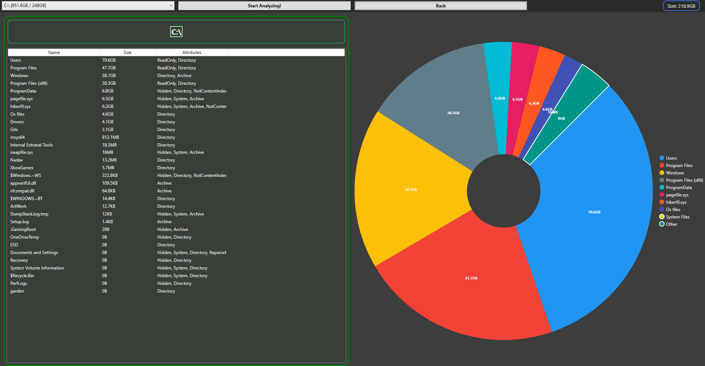

# **Windows Disk Analyzer**
### Simple analyze system to map the disk usage of files in the disk for windows

 
<!--Badges From https://github.com/ziadOUA/m3-Markdown-Badges-->

## About
> The system using C# Core and System.IO library to map the files sizes, 
> When the user pressing Analyze the system Start mapping by recursive  
> mapping every directory at the drive  

 

## How to use
> * Choose the drive you want at from the **list box** at the top left corner  
> * And than press the **Start Analyze** button next to the list box  
> * After pressing the software will start mapping the size of all the files it has access to in the selected drive
> * When the Analyze has finished a list of all the directories and files in the root of the driver will pop up
>   
>  Now you able to press any directory in the list *(you can also press on the pie chart)*  
> and the software will display the directories and files inside the selected directory 

 

## Planes For The Future 
* Make the Mapping run as async task
    * Add Progress bar
    
* Make UI Look better
* Add resource limiter
* Code Optimize
* Add Core Documentation

 

## Dependencies
* ### .Net Core 8 (For the smaller version)
* ### LiveCharts.WPF \[0.9.8\]
* ### LiveCharts \[0.9.8\]

 

## [Core Documentation](.docs/Core.md)  

## License
### [Apache License version 2.0, January 2004](./LICENSE)