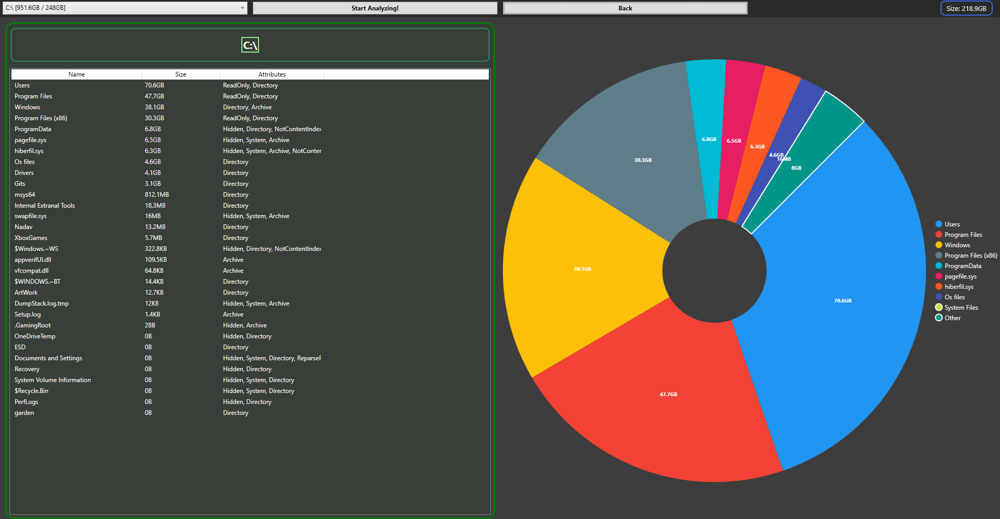

# Windows Disk Analyzer
### Simple analyze system to map the disk usage of files in the disk for windows

## About
> The system using C#.net and System.IO library to map the files sizes 
> when the user pressing Analyze the system Start mapping by recursive  
> mapping every folder files at the files tree 

 

## Planes For The Future 
* Make the Mapping run as async task
* Add Progress bar
* Make UI Look better
* Add resource limiter
* Code Optimize

 

## Dependencies
* ### .Net Core 8 (For the smaller version)
* ### LiveCharts.WPF \[0.9.8\]
* ### LiveCharts \[0.9.8\]

## License
### [Apache License version 2.0, January 2004](./LICENSE)
